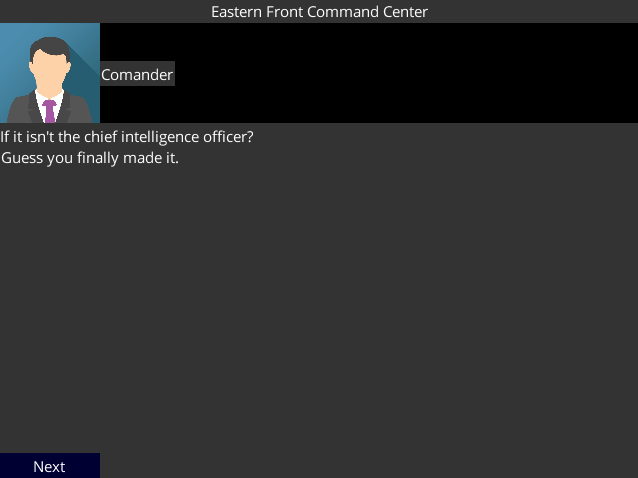
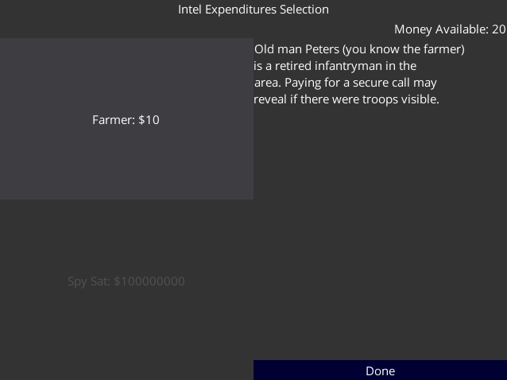
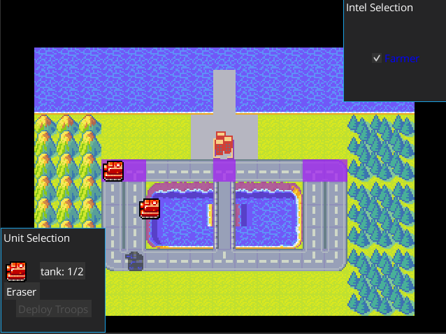
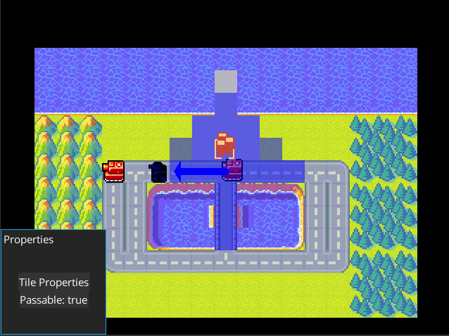

# 12/8 Making a playable tutorial

Working on adding the last few pieces of functionality to actually make the tutorial playable.

# 12/8 Looking at resizing options

After making the Android build, it was clear that I'd have to alter how text/button scaling worked to support that.

I did a little experimenting, but it seems like the primary issue is that Bitmap fonts aren't going to scale in a sensible way. It seems like I'll need to add logic for choosing font sizes based on resolution.

I can either manually generate a set of bitmap fonts or use https://github.com/libgdx/libgdx/wiki/Gdx-freetype .

# 12/7 Working on HTML build

I wanted to make sure the cross compiling was going to work before I finished things up. I generated a new project and tried to incorporate the HTML build into my main project.

After messing with the Gradle files I eventually got the build to run. I hit 3 issues right away.

1. GWT only supports a subset of the Java libraries so I would have to change some functions in my code.
2. I'm using a the library Gson and it wasn't clear how to import it into GWT and whether it would actually be supported.
3. My code was broken up into modules, and it wasn't clear how to properly capture this in teh GWT config.

None of these are total deal breakers, but I started a simpler project to test how bad 2 and 3 would be to address or whether I'd need to work around them.

I was able to run the basic project by running `/c/Python27/python -m SimpleHTTPServer 8081` after running the startHttpServer Gradle task. 

I did a small test project, and found out that Gson wasn't supported and the GWT is generally pretty rough. I decided to pause working on the HTML5 work and move on to Android.

Android was very straightforward to add. It took a little experimenting with the Gradle files, but that was mostly just because I didn't include it in the initial project.

In less then 15 minutes not including the downloads I was able to have a build working and running on my phone. The main problem is that the UI elements are way to small to see, so I'd need a more sensible scaling strategy.

# 12/5 Working toward making the tutorial "interesting"

With the basic logic in place, I'm working on adding the features to  make the tutorial take some strategy.

This is mostly filling in some more of logic around determining how units deploy in the campaign.

# 12/3 Finishing the win/lose conditions

Need close the loop on finishing battles. I'll make it so that losing your command center, loses the game. Otherwise losing your troops loses the battle.

I need to add some sort of retreat/reinforcement mechanic. 

# 11/30 Working on campaign map functionality

I've been slowly implementing the functionality to control troop movements on the campaign map.

The interface is extremely clunky, but I've resigned myself that it's mostly going to be a proof of concept for now.

This pretty much completes the bones of the project. There's still a lot of logic to fill in, but I should have a pretty set path towards implementing the tutorial campaign.

# 11/26 Refactoring away from LevelData

With the game design clearer, I was forced to go back to how I captured the descriptions of the levels.

I wanted to allocate the dialogue, shop items, and level details dynamically over the course of a campaign. I think ideally this would be a combination of static description files (Json for ex.) and Lua scripts.

For now however it's a lot easier just to create a Java class that handles giving the correct dialogue when needed and hard coding text in code.

# 11/25 Worked on unit test integration

After hitting an issue where I forgot to manually update a field in a copy constructor, I thought it would be a good example to add as a unit test.

I didn't realize that my unfamiliarity with Gradle would make this fairly time consuming. In the end it wasn't too bad, but I had to go through a lot of examples online that were either incomplete or outdated before I got something working.

An additional obstacle was initializing in a testing context since my code doesn't do a good job of isolating loaded resources.

# 11/23 Working on overworld map

Spent the last few days putting a little work into adding features to the overworld map.

Hit some issues getting the overlay elements looking alright and had trouble getting a readable font. I should consider looking into https://github.com/libgdx/libgdx/wiki/Distance-field-fonts for making more flexible scalable fonts.

# 11/20 Working on idea of campaign

I spent some time trying to figure out what a simple campaign mode would look like. I built a map using the same sprites as the actual battle that seems like a good starting point.

I think I'll make a tutorial campaign and another simple one as the baseline for the alpha.

# 11/20 Refactored GameStateManager

I refactored the GameStateManager and GameMenuBar to be generic to the specific game data. Totally unnecessary, but I felt that too much of the generic logic was getting added to the game specific package for convenience. 

# 11/19 Added Settings to Battle View

Added a method for setting a static callback in the menubar. Aside from fixing a resizing issue, mostly just worked.

# 11/17 Saving Battle State

I decided to try to get some basic load and save functionality working limited to the the current BattleScreen before I tried to implement it in it's full form.

It was pretty easy to add a menu bar and to populate it dynamically based on the available save slots.

I decided to use the Preferences interface for allowing HTML5 saves.

The first issue I hit was that Gson was failing to deserialize save data that it have serialized. It turned out that when using an object like a TilePoint as a key into a hashmap, Gson was serializing it as it's String representation. This would not correctly serialize back. This was easily fixed by adding enableComplexMapKeySerialization to the builder.

The second issue I hit was with doing deep copies of the game data. I was using a cache of the save data to handle loading and saving, but made the mistake of directly returning a pointer without doing a deep copy. I kind of went down the rabbit hole on the correct way to do deep copies in Java. https://stackoverflow.com/questions/2427883/clone-vs-copy-constructor-which-is-recommended-in-java and https://www.programmingmitra.com/2017/01/Java-cloning-copy-constructor-versus-Object-clone-or-cloning.html were decent resources. Even though it's a little more manual, I think copy constructors make more sense.

# 11/16 Settings Screen

Not the most interesting feature, but I decided to add a settings menu to trial run writing persistent data.

I was able to make a settings menu relatively simply, but I hit an issue with my plan to use JSON files to store persistent data. I found https://stackoverflow.com/questions/26227194/saving-and-loading-files-in-html5-with-libgdx which points out that the HTML5 build only supports https://github.com/libgdx/libgdx/wiki/Preferences as a means to persist data.

# 11/15 Title Screen

Looking for a title screen I realized I'm probably going to want a placeholder image for now. The initial thought I had was for a picture of an old fashion war room with the paddles for pushing figures of units around. Found some decent images when searching "Churchill war rooms".

For now I think I'll use one of these as a placeholder. Since pretty much all my assets are placeholders I think I'll just have to go back through after the initial version to commission an artist or find free replacements.  

# 11/15 Github CI

I remembered that GitHub had added some free CI awhile back, so I decided I might as well add a build test. Extremely straight forward, and I even added a little badge to the README.

# 11/15 Looked into music

Realized one feature I hadn't thought about was music and sound effects. Figured it was out of scope for the initial tasks, but added a TODO.
Also found some decent resources on https://lunalucid.itch.io/ and https://creativecommons.org/about/program-areas/arts-culture/arts-culture-resources/legalmusicforvideos/ 

# 11/14 Resume Dev at Home

Finished my trip, and I want to get this to an initial release. Here's the TODOs to cover for the initial release:

* C:\Users\feros\GitHub\gdx_tactics\core\src\com\axlan\fogofwar\Core.java
  * (75, 7) //TODO-P2 load custom skin
* C:\Users\feros\GitHub\gdx_tactics\core\src\com\axlan\fogofwar\logic\EnemyAi.java
  * (16, 3) //TODO-P2 Add comments
  * (17, 3) //TODO-P2 Add additional AI types
  * (18, 3) //TODO-P3 Work on improving AIs
  * (19, 3) //TODO-P3 improve system for allowing multiple AIs for development
  * (20, 3) //TODO-P3 make enemy actions respect fog of war
  * (21, 3) //TODO-P3 make MOVE understand how to improve state even if blocked off
* C:\Users\feros\GitHub\gdx_tactics\core\src\com\axlan\fogofwar\models\GameStateManager.java
  * (10, 5) //TODO-P1 add methods for saving and loading state, along with any missing data
  * (11, 5) //TODO-P1 Add save button as child class of actor stage
* C:\Users\feros\GitHub\gdx_tactics\core\src\com\axlan\fogofwar\models\LevelData.java
  * (221, 7) //TODO-P2 Allow items to persist between levels.
* C:\Users\feros\GitHub\gdx_tactics\core\src\com\axlan\fogofwar\models\LoadedResources.java
  * (71, 5) //TODO-P1 Add concept of multiple levels
* C:\Users\feros\GitHub\gdx_tactics\core\src\com\axlan\fogofwar\screens\BattleView.java
  * (45, 3) //FIXME-P1 fix weirdness with mouseMoved not always triggering
  * (47, 3) //TODO-P2 Add fog of war mechanic
  * (201, 9) //TODO-P1 complete logic for winning / losing
* C:\Users\feros\GitHub\gdx_tactics\core\src\com\axlan\fogofwar\screens\BriefingView.java
  * (61, 9) //TODO-P2 load speaker font and avatar based on name from map
  * (71, 7) //TODO-P3 Reskin and pretty up
* C:\Users\feros\GitHub\gdx_tactics\core\src\com\axlan\fogofwar\screens\PropertyWindow.java
  * (35, 5) //TODO-P2 Add all useful info to window
  * (58, 9) //TODO-P3 Clean up drawable generation
* C:\Users\feros\GitHub\gdx_tactics\core\src\com\axlan\fogofwar\screens\StoreView.java
  * (114, 7) //TODO-P3 Reskin and pretty up

The major features are still the one's described in the last entry.

Seems like going through the game in order makes sense. So the first thing I'll add is a title screen.

For posterity, here's what the current game looks like:

# 10/31 Separate the Battle State From the View

Took a couple week break. The next few features to work on are:

 * Wrapping the current scenes in a main menu and title screen
 * Add some sort of framework for having multiple levels
 * Add some basic save / load functionality
 * Finish the basic game logic to allow victory/loss
 
The first step to making some of this a bit easier is to separate out the state describing a battle.
Right now it is mixed in with the GUI logic of the view.

I did a refactor to pull out the state, and map data into their own classes.

Decided to go with one of the last small features before tackling the big ones, showing info on
terrain and units.

Decided to have a persistent window showing selected and hovered tile info.

# 10/14 Adding minimal AI

Using the refactored pathfinding, working on adding a minimal AI to get the example level playable.

# 10/8 Redoing distance calc functions

Needed to make the pathfinding more flexible ot allow AI to access movement.

Introduced a bug that makes enemies transparent after first unit is selected. Might have been present
before after attacking.

Turned out it was due to modifying the alpha value of a constant in the Color namespace.

# 10/7 Working on AI

Started doing groundwork to make enemy AI. Mostly refactoring to give AI access to needed info.

# 10/6 Working on BattleView

Slowing grinding through TODO list. Have been trying to follow structured commit style laid out in
https://www.conventionalcommits.org/en/v1.0.0/ .

# 10/5 Working on BattleView

As I go back to filling in the battle view logic I gave some thought to what the alpha would look
like. To add stakes to the campaign, I think the best game design is to give a starting army and
some amount of resources gain each turn based on the territory captured. The player will have to
decide the allocation of troops for each battle, knowing they won;t be immediately available for
other battles. They might decide not to commit troops to a battle that is too costly to win.

As I started to implement the actual battle logic, I realized that the enemy AI couldn't really be
on a unit by unit basis. I move the behavior to be for the whole scenario instead.

I hit a really weird bug where the mouseMoved callback in BattleView stops getting called if I
clicked and quickly moved the cursor. After a lot of fruitless debugging, it seems like this might 
be a result of the trackpad I'm using triggering a drag action or something.

# 10/4 Start Adding Missing Features to BattleView

With the refactor/cleanup/commenting totally done, it's back to adding actual features.
Created TODOs with the capabilities to fill in.

# 10/4 Refactor Package Organization

To make the organization a little clearer I organized the code that was somewhat generic to creating
a tactics game into the package `com.axlan.gdxtactics` while the code that is for the specific game
is under `com.axlan.fogofwar`. This is going to be a pretty fluid, but should help me think about
making as much of the interfaces as generic as possible.

One interesting point I hit was refactoring the ImmutableListTypeAdapterFactory. It should be
possible to infer the desired type from the generic parameter. However, since the generic is only
figured out at run time you can't access it's class information. There's probably a better way to
work around this, but I ended up having to pass it in as a function parameter.

# 10/2 Refactor TiledScreen

Refactored the tile screen to be a bit easier to understand and to properly resize.

# 9/28 - 10/1 Commenting code

Mostly finished the actual restructuring. Going back through the code to comment it, fix warnings, and other cleanup.

Learned you could classify TODOs in InelliJ so I added priority levels as I'm going through.

Some fairly major restructuring of the path finding API. Allowed the nodes to be generated on the
fly based on the tile map.

# 9/27 Massive Cleanup

Working on restructuring the code to make it cleaner. There are 3 main changes so far.

First I wanted to consolidate the constants / settings / shared resources. I created new classes to centralize this data.

Second I wanted to replace the GridPoint2 with a custom type that was immutable and fit better into the logic I was using.

Third I wanted to make the global data read into the program immutable, This turned out to be a fairly complex exercise.
GSON loads values directly into objects without setters or constructors. This meant it would skip immutable wrappers around the Lists.
To get it to actually create immutable lists, I had to create a TypeAdapterFactory.

# 9/26 Add Path Visualization

Building on the AStar demo, I worked on adding visual overlays to show the path, then animate the unit movement.

While there was some fiddling to get the positioning right, the first problem I hit was flipping the animated sprite.
The sheet only has a left facing version, so I was using the flip transform to make it face the other direction.
However, this transform was having no effect. I realized the setting the region to the frame of the animation was clearing the flip transform. I just needed to cache the state, and reapply it if necessary.

# 9/25 Starting Battle View

I spent some time dawdling since the project is getting large enough that it could use another reorganisation.
The main concern is that the shared data should be more centralized and access limited instead of just passing a bunch of references.
Also the constants should be centralized as well. For now I decided to plow forward and refactor once I get to the point of adding the concept of multiple levels.

I started adding the basic guts of the battle view and I'm at the point I want to add the pathfinding. It was a little confusing to figure out how to get the properties for the tiles, but evetually got the logic I needed.

I decided to remake my AStar app as a demo.

# 9/24 Added Stats

Added a stats file with the stats for the different types of units. Did a little refactoring to move
the deployment information to the new BattleView. 

# 9/23 Intel Selection Screen

I finished up the UI for deploying available troops. I ended up adding a layer on top of the UI to make the selected unit more obvious.

Next I added a menu to turn the various intelligence sources on and off. Nothing new with any of this.

The level descriptions are pretty complicated and theirs some unresolved subtly on what I'll want to change to do them for real.

# 9/22 Starting Map Logic

First I thought about how to move troops around and realized I would need path finding. I remembered writing a Java A* algorithm back in college https://en.wikipedia.org/wiki/A*_search_algorithm .

Next I started adding the additional data and logic to create a view for deploying troops and viewing intel.

Hit two weird issues when trying to add transparent shapes. First it seems like the tilemap renderer changes the GL settings.

I was hitting this issue: https://stackoverflow.com/questions/14700577/drawing-transparent-shaperenderer-in-libgdx , but I had to change the blend mode after the tilemap renders.

The second issue I hit was the ShapeRenderer and SpriteBatch can't have their begin and end sections overlap. The sprite batch was failing when I did this.

# 9/22 Playing Around with Graphics

I spent some time getting a little particle effects demo working.

Next I looked into getting an animation https://github.com/libgdx/libgdx/wiki/2D-Animation . Once I got the animation working, I extended the sprite class to be able to apply its transforms to make manipulating an animated sprite easier.

# 9/21 Start Laying Out BattleMap for Game

Cleaned up the map. Added atlas with tank sprites and got a decent pattern for breaking out individual files.

# 9/21 Clean up Scene / Screen Switching

I'm not totally clear on the logical orginaztion of the objects like game / scene / screen. It seems
like I can clean up my views by making them extend screen. I need to figure out how to control between them.

Basically followed the example https://libgdx.info/basic_screen/ , but used callbacks to allow the core to activate new screens.

# 9/21 Starting Map Screen

Started by trying to find other projects I could use code from.

Best I found was https://github.com/yairm210/UnCiv which is in Kotlin and https://github.com/pixdad/Tactical-Battle-System which is basically just a Tiled demo.

From there I started looking at https://github.com/libgdx/libgdx/wiki/Tile-maps which got me to download Tiled map editor.

Since neither of the examples I found seemed sufficient, I decided to look for a sprite pack. https://itch.io/game-assets/free/tag-tilemap seemed like the best set of resources.

https://www.spriters-resource.com/ is also good for published game sheets.

The first decision is what sort of geometry to use, orthogonal, isometric, or hex. I decided to go with the simplest Ortho projection for now. On top of that the Advanced Wars spritesheet seems like a good mock up for now.

I was able to get a decent initial implementation by taking https://github.com/pixdad/Tactical-Battle-System and cleaning up the interfaces a bit. 

Next I started using my own advanced wars map. This led me to play with the scaling on work on the tile to pixel transforms.

Turns out https://github.com/pixdad/Tactical-Battle-System was just a copy of https://www.gamefromscratch.com/post/2014/05/01/LibGDX-Tutorial-11-Tiled-Maps-Part-2-Adding-a-character-sprite.aspx

# 9/20 Implementing Menus

I created a class to layout and control the briefing dialogue. Following the table guide, I was mostly able to reproduce the layout without issue.

The one strangeness I hit was when I wanted a button to be on top of a label. Initially I tried a stack, but the button would will the space allocated to the stack covering up the label. Nothing I did seem to affect this. Next I tried a WidgetGroup. I still don't really understand how these work, but it got the layout I wanted by default.

Since I wouldn't actually want the text to overlap, I ended up going back to just using a table, but still shows I don't fully understand the advanced layout behaviors.

Churned through the first couple menus without much more incident.

# 9/19 Starting Actual Project

Going to start porting the code from https://github.com/axlan/Conqueror-of-Empires/tree/fog_war

First I'll take the level loading logic. I played around with the JSON to Java object parsing and found GSON https://github.com/google/gson seemed good.

With that done, I went back to https://www.gamefromscratch.com/post/2015/02/03/LibGDX-Video-Tutorial-Scene2D-UI-Widgets-Layout-and-Skins.aspx and got it working with VisUI.

From there I started working on the briefing view. It looks like I have all the tools I need to put it together, just figuring out the formatting.
https://github.com/libgdx/libgdx/wiki/Table gives the details I need to do the layout.

#9/19 Experiment with LML and starting game 

Following the recommendation of one of the tutorials I decided to take a look at https://github.com/czyzby/gdx-lml . I spent a good amount of time learning the ins and outs of the markdown language. 

After some problems with attributes I realized a list of tags and attributes is in: 

https://github.com/czyzby/gdx-lml/blob/master/lml/src/main/java/com/github/czyzby/lml/parser/impl/DefaultLmlSyntax.java 
and 
https://github.com/czyzby/gdx-lml/blob/master/lml-vis/src/main/java/com/github/czyzby/lml/vis/parser/impl/VisLmlSyntax.java 
After some poking I was able to size objects too. 

However, it looks like it's just not worth the additional obfuscation of the code.  http://czyzby.github.io/gdx-lml/lml-vis/ is still useful for looking at the available layout. 

VisUI https://github.com/kotcrab/vis-ui still looks useful enough to use as the base skin for development. See also https://vis.kotcrab.com/demo/ui/ 
 
# 9/18 Learning to do basic UI

Went down a HUGE rabbit hole. I spent basically 9 hours figuring out how to style the UI in libGDX 

Started with: 

https://www.gamefromscratch.com/post/2015/02/03/LibGDX-Video-Tutorial-Scene2D-UI-Widgets-Layout-and-Skins.aspx 

This gave a basic example of how to create UI elements (see https://github.com/libgdx/libgdx/wiki/Scene2d.ui ). There were a few problems (Align was moved to com.badlogic.gdx.utils.Align and I needed to download Hiero from here https://libgdx.badlogicgames.com/tools.html instead of running the included JAR), but I got it working without too much trouble. 
 
Next I wanted to draw a textbox with a border. After a lot of digging I realized you needed to set a ninepatch as the background of an element to create a border. I found https://github.com/libgdx/libgdx/wiki/Ninepatches which sort of explains how they work. However I wanted to be able to use a .9.png so I didn't need to specify the border manually. I found the tool  

https://romannurik.github.io/AndroidAssetStudio/nine-patches.html to generate them. I ended up making a basic rectangle border ninepatch in GIMP. 

A lot of stuff I was reading recommended using the Skin object to handle UI configuration https://github.com/libgdx/libgdx/wiki/Skin which is what parses the UI JSON. I sort of figured out how it worked, but I couldn't understand how the images were being packaged into ninepatches 

After lots and lots of digging I found: https://www.gamefromscratch.com/post/2013/12/18/LibGDX-Tutorial-9-Scene2D-Part-3-UI-Skins.aspx as an example which shows that a lot of the associations are happening automagically. Basically the JSON, atlas, and spritesheet seem to just need to have the same name. The JSON seems to automatically be aware of the atlas regions and seems to be able to fix the font image paths. Eventually I realized the sane way to do all this is to use the tool https://ray3k.wordpress.com/software/skin-composer-for-libgdx/ which can be downloaded https://github.com/raeleus/skin-composer . There's even a gallery of example UI's https://github.com/czyzby/gdx-skins which also has links to other useful articles. 