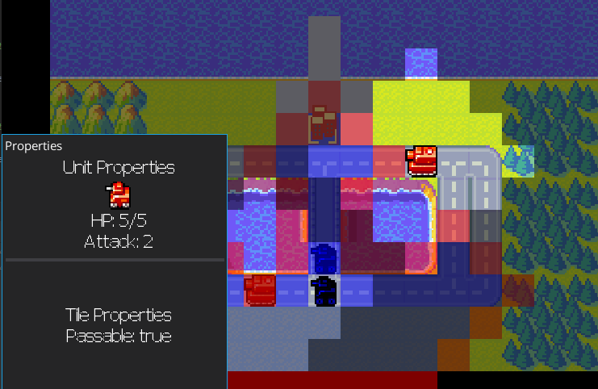

# gdx_tactics

  * See the game in action: https://www.youtube.com/watch?v=40V8IQZcXz8
  * See http://www.robopenguins.com/fog-of-war-game/ for a writeup of the high level design
  * [Dev Journal](DEV_JOURNAL.md) capturing a timeline of what I worked on. Includes roadblocks I hit and resources I found.

# Summary

A hobby project to make a tactics game focused on intelligence gathering.

The goal of the game is to make a tactics game inspired by Advanced Wars, but with an espionage and campaign tactics element.

Resources can be spent on building units, or on gathering information on what the enemy is doing.

While battles focus on a single battlefield, meta decisions need to be made about which battlefields resources should be committed to.

# Status

Finished an alpha demo of the games basic functionality.

I implemented these high-level features:
  * Tactical map to engage in battle
  * Campaign menu to connect individual battles
  * Add win and loss mechanic to give the game a goal
  * Dialogue screen for story and instructions
  * Menu for deploying troops
  * Menu for buying resources
  * Basic functional enemy Ai
  * Playable in Android
  * UI with custom skin
  * Save/load to work for campaign or battles
  * Configuration for specifying units and maps
  * Packing and animating sprites

Development is done for now unless I find folks interested in contributing.
